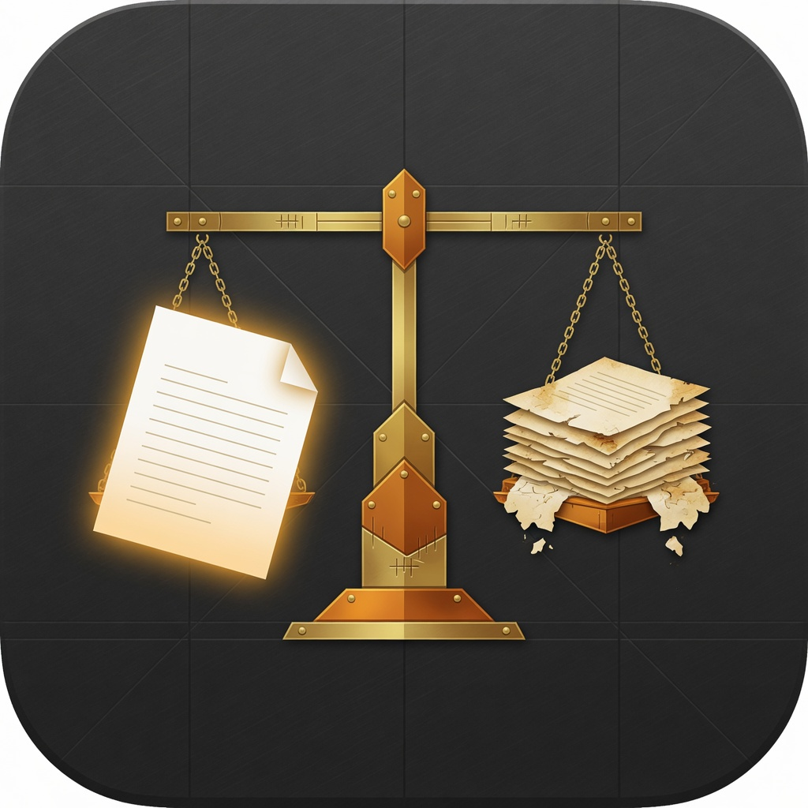

# context-bench

<p align="center">
  
</p>

**Does your CLAUDE.md actually make the model better — or just quieter about doing what it would have done anyway?**

Boris Cherny told a YC room to delete their CLAUDE.md, skills, and hooks every six months and see what happens. [Nate Herk's video](https://youtu.be/XNQBCRcwXV4) is what made that advice land. This repo turns it into a score.

<p align="center">
  
</p>

**42-second film:** [`docs/assets/context-bench.mp4`](docs/assets/context-bench.mp4) (16:9) · [`docs/assets/context-bench-9x16.mp4`](docs/assets/context-bench-9x16.mp4) (Reels / Shorts / TikTok)

## What it does

Runs a fixed set of **Cases** (prompt + grading rubric) against a matrix of **Profiles** — every combination of {model} × {your context bundle vs. nothing extra} — then has a separate judge model score every response against that Case's rubric, **blind** to which Profile produced it.

```
Case × Profile → Run        (raw output)
Run × Judge    → Judgment   (1-10 + one-sentence reason)
Judgments      → Leaderboard (mean score + KEEP / PROMPT_BLOAT / REMOVE)
```

Vocabulary: [`CONTEXT.md`](./CONTEXT.md).

## 30-second version

| Arm | What the model sees |
|---|---|
| `bare` | The Case. No extra bundle. |
| `+your-dir` | The Case, plus every `*.md` in that directory. |

If the bundle's delta is ≥ +1.5, the matrix says **KEEP**. If it's ≤ −1.0, **REMOVE**. In between is **PROMPT_BLOAT** — probably not earning its tokens.

A real run of the synthetic demo bundle (`examples/context`) looked like this:

| Model | Bare | +example | Δ | Call |
|---|---|---|---|---|
| Haiku 4.5 | 8.5 | 9.3 | +0.83 | PROMPT_BLOAT |
| Sonnet 5 | 8.5 | 9.0 | +0.50 | PROMPT_BLOAT |
| Opus 5 | 8.3 | 7.3 | −1.00 | REMOVE |

Same six Cases. Same judge. Opus got worse with the extra notes. That is the whole point of measuring.

<p align="center">
  
  
</p>

## Quickstart

No API key needed for Claude Profiles or the judge — they run through your local `claude` CLI on your existing OAuth session (`claude /login`).

```bash
python3 -m venv .venv && source .venv/bin/activate
pip install -e .

# Demo: synthetic Acme Labs bundle vs bare
python3 -m contextbench.cli --smoke

# The run that matters: YOUR CLAUDE.md / skills directory
python3 -m contextbench.cli --context-dir ~/.claude

# One skill at a time
python3 -m contextbench.cli --context-dir ~/.claude/skills/caveman --models opus
```

`export XAI_API_KEY=...` optionally adds Grok Profiles (`--models xai:grok-4`).

Results land in `results/runs_<ts>.json`, `results/judged_<ts>.json`, and a rendered `results/leaderboard_<ts>.md`.

### Flags that make it usable

| Flag | What it does |
|---|---|
| `--context-dir PATH` | Bundle to test. Repeatable. Default is `examples/context`. |
| `--wrap fair` | Default. Case is the user message; notes are optional system context. |
| `--wrap system` | Notes go in as a raw system prompt (CLAUDE.md-shaped prose). |
| `--wrap raw` | Reproduce the old "System Instructions:" user-turn wrap (issue #1). |
| `--models opus,sonnet,haiku` | Or `provider:model-id`. |
| `--smoke` | First Case × first model. Use this before a 6×3×N burn. |

## Read the leaderboard honestly

The judge is a model call, not ground truth. Read a few `results/judged_*.json` reasoning strings before trusting a delta. If a Profile swings on 1–2 Cases, that is noise — there are six rubric-graded Cases here, not a statistically powered benchmark.

**SKILL.md files are not Claude Code skills in this bench.** v1 concatenates markdown into a system prompt. That is the right test for a CLAUDE.md. It is the wrong test for a skill that is supposed to be invoked by name. `--wrap fair` stops Opus/Sonnet from treating the dump as a jailbreak (see [ADR 0004](./docs/adr/0004-fair-cli-wrapping.md) and [issue #1](https://github.com/YoungMoneyInvestments/context-bench/issues/1)). A real harness-invocation lane is still future work.

### Known limitation: `bare` isn't zero-context

Running through `claude -p` so it can use your OAuth session means your own `~/.claude/CLAUDE.md` / skills / hooks load on *every* Profile, `bare` included. There is no flag that disables that without also disabling OAuth ([ADR 0003](./docs/adr/0003-bare-is-relative-to-ambient-config-under-oauth.md)). The constant cancels out of the `bare` vs `+bundle` Delta. Absolute scores are *your* scores, not a universal number.

## Adding Cases

Drop a YAML file in `cases/`:

```yaml
category: coding
prompt: |
  <the task>
rubric:
  - <criterion the judge should check>
  - <another criterion>
```

## Why this exists

Anthropic deleted ~80% of Claude Code's own system prompt when Opus 5 shipped. The model got better. Boris's follow-up was: do the same thing to *your* stack, on a six-month cadence.

People have been doing that as a vibe check. context-bench is the vibe check with a rubric and a blind judge.

Watch: [I Deleted All My Claude Skills... And Claude Got Smarter](https://youtu.be/XNQBCRcwXV4) · [Boris at YC Startup School](https://www.youtube.com/watch?v=qyPCVqFUyDo)

## License

MIT
